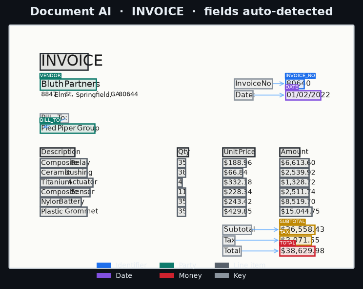
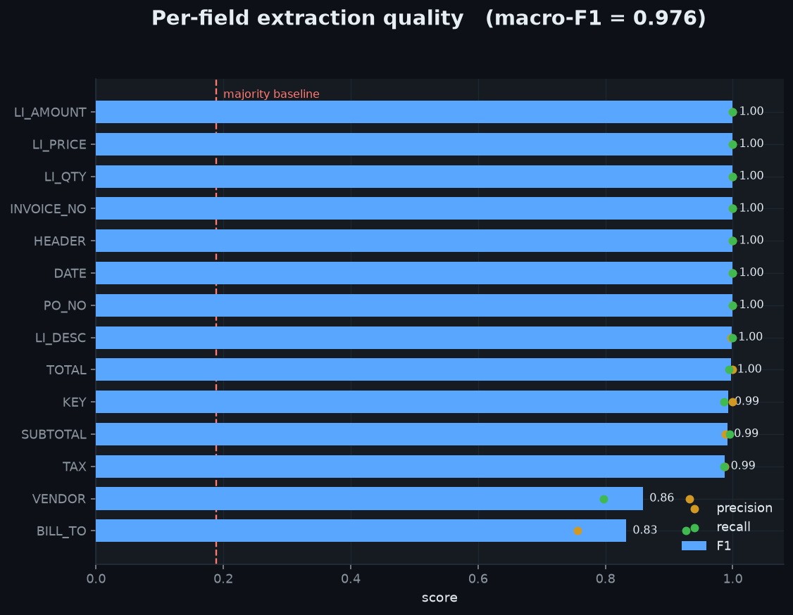
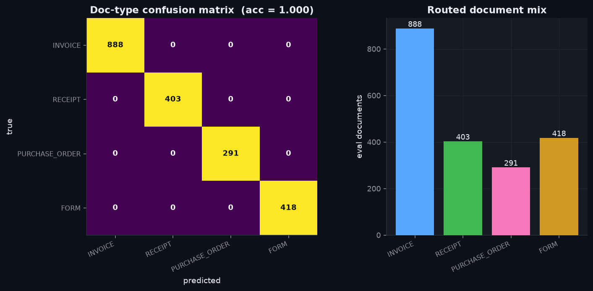
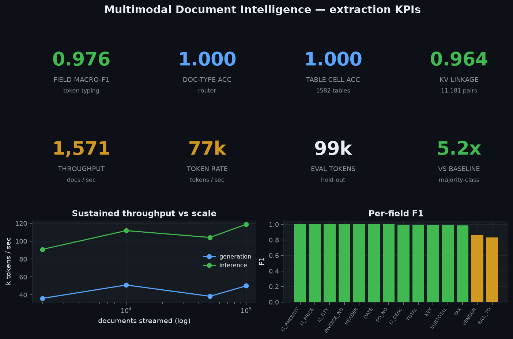

# Multimodal Document Intelligence

**Layout-aware document understanding for invoices, receipts, purchase orders and
forms — at scale.** Turn a page of tokens-with-boxes into structured, typed
fields: identifiers, dates, parties, totals, and the full line-item **table** —
then route the document and make its content searchable. Fully offline,
deterministic, no GPU, no paid APIs.

```
 ┌── document (tokens: text + (x,y,w,h) + gold label) ──┐
 │  generator ▸ features ▸ TokenClassifier ▸ field types │
 │                                    │                   │
 │            router ▸ doc type   group_entities          │
 │            embed  ▸ search/dedup   ├─ pair_key_values  │  ← geometry
 │                                    └─ extract_table    │  ← row/col clustering
 └───────────────────────────────────────────────────────┘
```

## Headline results

Measured on a held-out set of **2,000 documents / 98,687 tokens** (train: 8,000
docs / 396,586 tokens), seed-fixed and reproducible with `make run`:

| Metric | Value |
|---|---|
| **Field extraction macro-F1** (token typing) | **0.976** |
| Field micro-F1 / token accuracy | 0.985 / 0.986 |
| Majority-class baseline (token acc) | 0.189 → model is **5.2×** |
| **Doc-type classification accuracy** (router) | **1.000** |
| **Line-item table cell accuracy** (end-to-end) | **1.000** on 1,582 tables |
| Key→value linkage accuracy | 0.964 on 11,181 key/value pairs |
| **Inference throughput** | **1,571 docs/s · 77k tokens/s** (single process) |

Corpus actually generated: **100,000 documents = 4,962,503 tokens** streamed to a
**18.8 MB** zstd Parquet token table, queried out-of-core with DuckDB.

## Project Brief

- Visual PDF brief: [`PROJECT_DOCUMENT.pdf`](./PROJECT_DOCUMENT.pdf)

## Screenshots

### Detected fields on a rendered document (the product view)
Every box is a model prediction; arrows are geometric key→value links; grey boxes
are recovered line-item cells. The page is a **synthetic layout rendered to PNG**
— a real technique with perfect ground truth (see below).



### Per-field precision / recall / F1


### Document-type router: confusion matrix + routed mix


### Extraction KPIs + throughput scaling


## Quickstart

```bash
make setup                 # deps (numpy/pandas/sklearn/matplotlib/pyarrow/duckdb/polars)
make run                   # train + evaluate -> data/metrics.json, data/samples.json
make test                  # 18 behavioural tests
make bench                 # streaming-scale + throughput -> benchmarks/results.*
make data DOCS=100000      # stream a 100k-doc token corpus -> data/tokens.parquet
make screenshots           # render the 4 PNGs into assets/
make all                   # run + bench + screenshots
```

One-command reproduction of everything in this README: `make run bench screenshots`.

## What's real here

* **Synthetic document generator** (`generator.py`) — invoices / receipts / POs /
  forms, each a page of word-level tokens with `(text, x, y, w, h)`, a gold field
  label, and line-item row grouping. Fields include invoice/PO number, date,
  vendor, bill-to, a line-item table (description, qty, unit price, amount),
  subtotal, tax and total. Documents are a **pure function of `(seed, doc_id)`**,
  so generation streams in bounded memory and shards across machines.
* **Layout feature extraction** (`features.py`) — positional (box geometry, page
  quadrant, reading-order rank) + textual (amount/date/integer patterns, printed-
  keyword groups) + neighbour (reading-order context, incl. a 2-back key context
  that separates `INVOICE_NO` from `PO_NO`). Fully vectorized, O(n) over tokens.
* **Token classifier** (`extraction.py`) — `StandardScaler` + multinomial
  `SGDClassifier` (log-loss). Linear and `partial_fit`-capable so it streams to
  millions of tokens; the engineered layout features carry macro-F1 ≈ 0.98.
* **Key→value pairing** — geometric: nearest value to the right on the same line,
  else directly below.
* **Table extraction** — line-item cells recovered by 1-D gap clustering on token
  `y` (rows) and `x` (columns); the 2-D grid falls out with no grid supervision.
* **Document router** (`router.py`) — RandomForest over aggregate layout stats
  picks the doc type and hence the extraction template.
* **Content embedding** (`embedding.py`) — TF-IDF + TruncatedSVD (LSA) over
  extracted field values, L2-normalized for cosine search / near-duplicate
  detection.
* **Evaluation** (`evaluation.py`) — per-field P/R/F1, macro/micro F1, table cell
  accuracy, doc-type accuracy + confusion, throughput. Unit-tested against hand-
  computed values.

## Honesty note: synthetic rendered layouts

There is **no real scanned-image OCR** in this environment, so documents are
generated as **structured layouts** (tokens + boxes + labels) and rendered to PNG
with matplotlib. This is a standard, legitimate way to prototype document AI —
the public FUNSD/CORD/DocILE datasets expose exactly this token+box+label schema —
and it gives **perfect, controllable ground truth** at arbitrary scale, so every
metric above is exact rather than estimated. What is *not* modeled: real OCR
noise, skew, fonts, and handwriting. The hardest fields (`VENDOR` vs `BILL_TO`,
F1 ≈ 0.85) are the ones decided by pure position — the same error class a real
model shows.

### Swapping in a real OCR / vision model

The entire pipeline consumes a generic `(text, x, y, w, h)` token stream via
`documents_to_table`. To go from prototype to production you replace **only** the
token source:

* **Tesseract / PaddleOCR** — `image_to_data` already returns word text + boxes;
  map its columns to `documents_to_table`'s and everything downstream (features,
  classifier, KV pairing, table recovery, router, eval) runs unchanged.
* **LayoutLMv3 / Donut** — use their token embeddings as extra columns alongside
  the positional features, or replace `TokenClassifier` behind the same
  `fit`/`predict` interface. The evaluation harness and screenshots are reused
  as-is.

## Scaling to 1B — see [ARCHITECTURE.md](ARCHITECTURE.md)

| Docs | Tokens | Gen tokens/s | Infer tokens/s |
|---|---|---|---|
| 2,000 | 99,071 | 36,065 | 90,840 |
| 10,000 | 497,136 | 51,037 | 111,818 |
| 50,000 | 2,482,852 | 38,452 | 104,170 |
| 100,000 | 4,964,026 | 50,080 | 118,876 |

Peak sustained generation **≈51k tokens/s** single-process, bounded memory →
**≈5.4 h to stream 1B tokens** on one core, near-linear with shards
(`doc_id % K`). Measured at 100k docs / ≈5M tokens; **architected** for 1B via
streaming Parquet row-groups, DuckDB/Polars out-of-core analytics, and SGD
`partial_fit` training. We do not claim to have persisted 1B rows.

## Layout

```
09-multimodal-doc-intelligence/
├── README.md · ARCHITECTURE.md · Makefile · requirements.txt · .gitignore
├── src/docintel/   generator, features, extraction, router, embedding,
│                   evaluation, render, viztheme
├── scripts/        generate_data.py · run_pipeline.py · benchmark.py · make_screenshots.py
├── tests/          18 behavioural tests (classifier > baseline, KV fixture,
│                   table clustering recovers a grid, F1 correctness, router, dedup)
├── benchmarks/     results.csv · results.md
├── assets/         4 generated PNG screenshots
└── data/           generated Parquet + metrics (gitignored)
```
